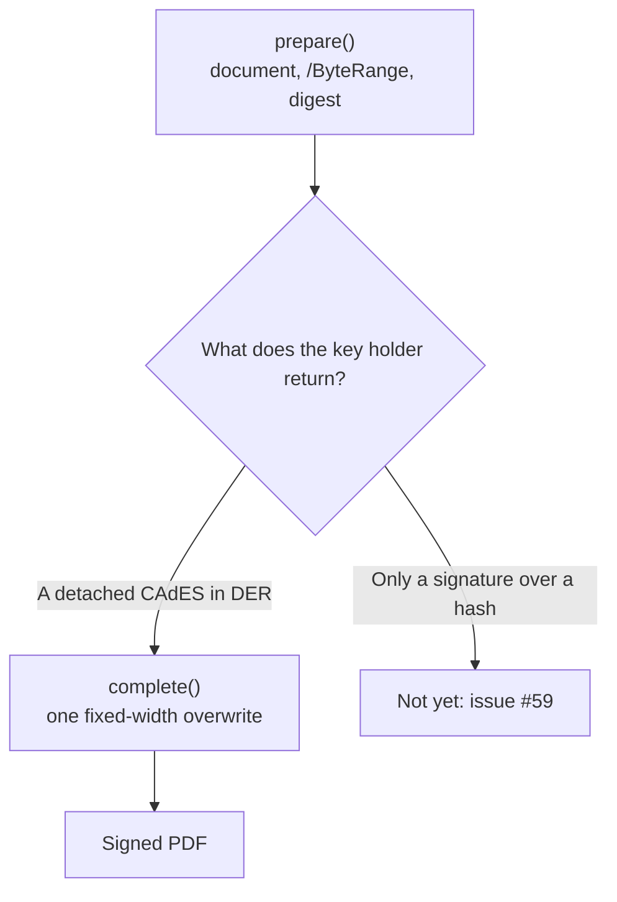
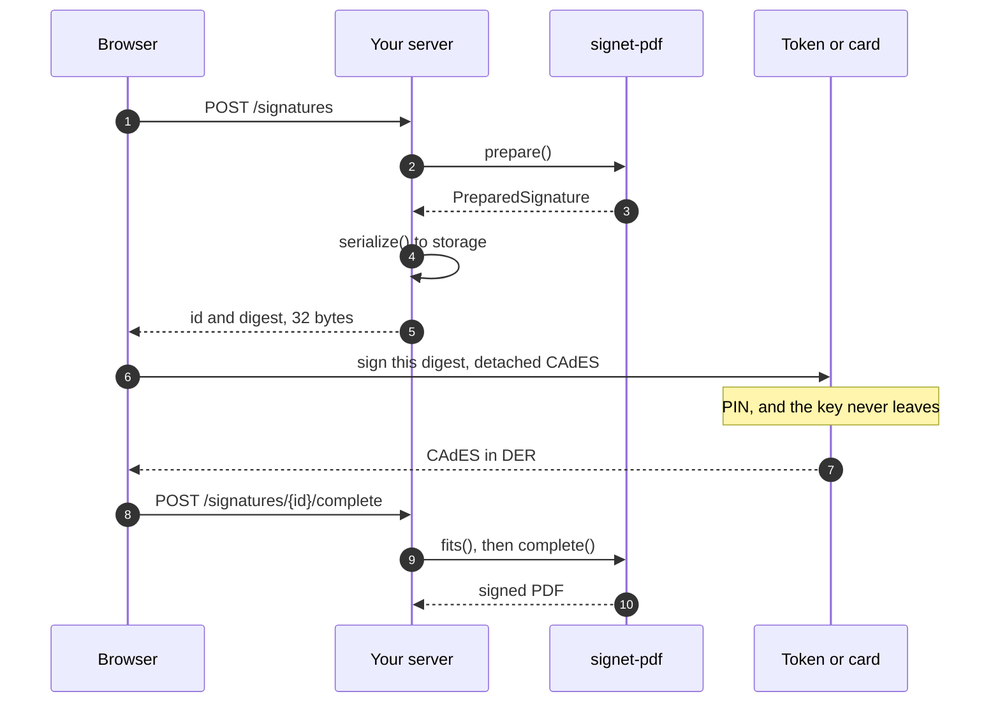
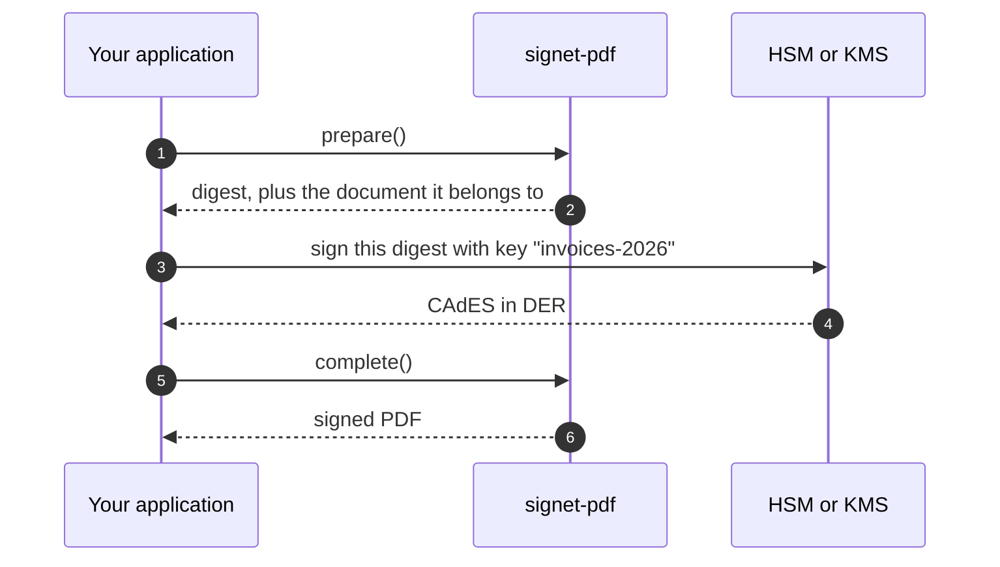
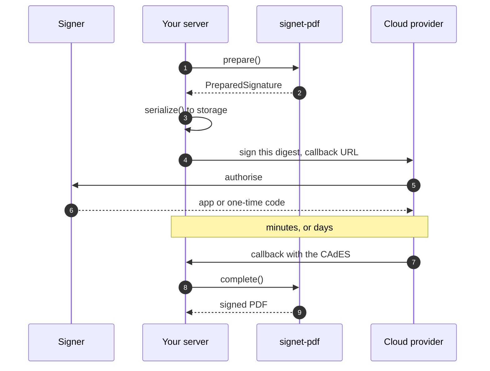

# Two-phase signing

The private key does not have to be in this process.

`prepare()` writes everything a signature needs except the signature: the
revision is appended, the `/ByteRange` holds its real offsets, and the
`/Contents` placeholder is still empty. What comes back is a complete document
whose offsets no longer move, so finishing it is one fixed-width overwrite that
can happen anywhere, at any time.

That is what makes a key on an A3 token, in an HSM, or behind a cloud service
(BirdID, NeoID, VidaaS) usable at all
([0116](../decisions/0116-signing-has-two-phases.md)).

## The two calls

```php
use LSNepomuceno\Signet\Signet;

$signet = new Signet();

$prepared = $signet->newSignature()
    ->pdf('/path/contract.pdf')
    ->info(name: 'Lucas Nepomuceno', reason: 'Contract')
    ->prepare();

// ... somewhere else, with the key ...

$signed = $signet->complete($prepared, $cms);

$signed->save('/path/contract-signed.pdf');
```

**No certificate is passed to `prepare()`.** Nothing before the CMS reads a
private key, and the builder only wants one if you ask it to draw a seal from
the certificate, which is an appearance rather than a cryptographic act.

## What the prepared signature carries

`Data\PreparedSignature` is a value object, and everything on it is what the
other side needs:

| | |
|---|---|
| `document` | the bytes as they stand, placeholder and all |
| `byteRange` | the four numbers written into `/ByteRange` |
| `reservedBytes` | what the placeholder can hold |
| `digest` | the `Enums\DigestAlgorithm` the CMS will be computed under |
| `digestValue` | the digest of the covered bytes, raw |
| `profile`, `fieldName`, `certification` | what phase one wrote |

Three methods do the work of sending it somewhere:

```php
$prepared->digestBase64();    // what a signing service usually asks for
$prepared->digestHex();       // the same, as the CMS carries it
$prepared->signableBytes();   // the covered span, for a producer that hashes itself
$prepared->fits($cms);        // before committing to a signature from elsewhere
```

`digestValue` is exactly the `message-digest` attribute the finished CMS
commits to. That is asserted rather than assumed: `tests/Signing/TwoPhaseSigningTest.php`
reads the attribute back out of the signature and compares it.

## Crossing a process

The object is self-contained, so `serialize()` round-trips it as it stands,
binary document and enums included:

```php
$queue->push(serialize($prepared));

// another process, hours later
$signed = $signet->complete(unserialize($stored), $cms);
```

Usually only `digestBase64()` travels and the document stays where it already
is. That is the cheaper shape and the one a browser-side signer needs.

**The document password is not on the object.** `complete()` takes it as an
argument instead, because a prepared signature is written to a queue or a
database by design, and a password stored beside the document it opens is not a
password ([0030](../decisions/0030-signing-a-document-that-is-encrypted.md)).

```php
$signet->complete($prepared, $cms, documentPassword: $password);
```

## What the CMS has to be

A detached CMS, in DER, over `PreparedSignature::signableBytes()`, carrying what
PAdES requires: `content-type`, `message-digest`, and the ESS
`signing-certificate-v2` attribute of RFC 5035. That is what
`Signing\Cades\CadesBuilder` produces, and what a conformant remote signer
produces too.

A CMS larger than `reservedBytes` cannot be embedded, and `complete()` says so
rather than truncating it:

```
the 17000-byte signature does not fit the 8192-byte reserved space
```

## Where the key actually is

One question decides every integration of this kind, and it is worth asking
before any code is written: **what does the thing holding the key give back?**

| It gives back | Then |
|---|---|
| A detached CAdES, in DER | everything on this page works today |
| Only a raw RSA or ECDSA signature over a hash | not yet: [#59](https://github.com/lsnepomuceno/signet-pdf/issues/59) |

The reason the line falls there: building a CMS means writing the signed
attributes and signing the hash of **those**, not the hash of the document. So
whoever assembles the CMS needs the key, and the split this package can offer is
the one where it hands over a digest and takes back an assembled CAdES.



The three sections below are the three places a key actually lives. The server
code is nearly the same in all of them, which is the point of the split.

### An A3 token or a smart card, in the user's browser

The key is on a device plugged into somebody's machine, and PHP on your server
cannot reach it, ever. So the digest travels to the browser and the CAdES comes
back.

**The document never leaves the server.** Thirty-two bytes go out and a few
kilobytes come back, whatever the file weighs.



Phase one, as an HTTP endpoint:

```php
use LSNepomuceno\Signet\Enums\SignatureProfile;
use LSNepomuceno\Signet\Signet;

/**
 * POST /signatures
 *
 * No certificate, no key, no token. Nothing the signer owns is needed to write
 * everything except the signature itself.
 */
final readonly class StartSignature
{
    public function __construct(
        private Signet $signet,
        private PreparedSignatures $pending,
    ) {}

    /**
     * @return array{id: string, digest: string, algorithm: string}
     */
    public function __invoke(string $documentPath, string $signerName): array
    {
        $prepared = $this->signet->newSignature()
            ->pdf($documentPath)
            ->info(name: $signerName, reason: 'Service agreement')
            ->profile(SignatureProfile::PadesBB)
            ->seal()
            ->prepare();

        return [
            'id' => $this->pending->put($prepared),
            'digest' => $prepared->digestBase64(),
            'algorithm' => $prepared->digest->value,
        ];
    }
}
```

The prepared signature has to survive until the browser answers, so it goes to
storage. It is a value object and `serialize()` round-trips it whole:

```php
use LSNepomuceno\Signet\Data\PreparedSignature;
use LSNepomuceno\Signet\Enums\CertificationLevel;
use LSNepomuceno\Signet\Enums\DigestAlgorithm;
use LSNepomuceno\Signet\Enums\SignatureProfile;

final readonly class PreparedSignatures
{
    public function __construct(private PDO $database) {}

    public function put(PreparedSignature $prepared): string
    {
        $id = bin2hex(random_bytes(16));

        $this->database
            ->prepare('INSERT INTO prepared_signatures (id, payload, created_at) VALUES (?, ?, ?)')
            ->execute([$id, serialize($prepared), date('Y-m-d H:i:s')]);

        return $id;
    }

    public function take(string $id): PreparedSignature
    {
        $statement = $this->database->prepare('SELECT payload FROM prepared_signatures WHERE id = ?');
        $statement->execute([$id]);

        $payload = $statement->fetchColumn();

        if (! is_string($payload)) {
            throw new RuntimeException("no prepared signature {$id}");
        }

        // The allowlist matters: this row is read back from a database, and an
        // unserialize() with no allowed_classes will instantiate whatever the
        // string names.
        $prepared = unserialize($payload, ['allowed_classes' => [
            PreparedSignature::class,
            SignatureProfile::class,
            DigestAlgorithm::class,
            CertificationLevel::class,
        ]]);

        if (! $prepared instanceof PreparedSignature) {
            throw new RuntimeException("prepared signature {$id} did not survive storage");
        }

        return $prepared;
    }
}
```

The browser hop is the part this package cannot write for you, because it
belongs to whatever component reaches the token. What it has to produce is not
vendor-specific:

```js
const { id, digest, algorithm } = await fetch('/signatures', {
  method: 'POST',
  body: form,
}).then(response => response.json())

// Whichever component talks to the token: a browser extension, a native
// helper, a local agent. The requirement is the shape rather than the vendor:
// a DETACHED CAdES over that digest, carrying signing-certificate-v2.
const cms = await tokenComponent.signCades({ digest, algorithm, detached: true })

await fetch(`/signatures/${id}/complete`, {
  method: 'POST',
  headers: { 'Content-Type': 'application/json' },
  body: JSON.stringify({ cms }),
})
```

Phase two takes it back:

```php
/**
 * POST /signatures/{id}/complete
 */
final readonly class FinishSignature
{
    public function __construct(
        private Signet $signet,
        private PreparedSignatures $pending,
    ) {}

    public function __invoke(string $id, string $cmsBase64): string
    {
        $prepared = $this->pending->take($id);

        $cms = base64_decode($cmsBase64, strict: true);

        if ($cms === false) {
            throw new InvalidArgumentException('the signature is not base64');
        }

        // Ask before committing. complete() refuses an oversized CMS rather
        // than truncating it, and a refusal after the user has already touched
        // their token is a bad place to find out.
        if (! $prepared->fits($cms)) {
            throw new RuntimeException(sprintf(
                'the %d-byte CAdES does not fit the %d bytes reserved',
                strlen($cms),
                $prepared->reservedBytes,
            ));
        }

        return $this->signet->complete($prepared, $cms)->save("/documents/{$id}-signed.pdf");
    }
}
```

### An HSM, on your own side

The key is in an appliance or a cloud KMS your backend can reach, so there is no
browser in the picture and nothing has to wait. Two routes, and the first needs
no wiring at all:




**Split the call.** `prepare()`, hand the digest to whatever speaks PKCS#11,
`complete()`. Exactly the two calls above, in one function:

```php
$prepared = $signet->newSignature()
    ->pdf('/documents/contract.pdf')
    ->info(name: 'Acme Ltd', reason: 'Invoice')
    ->prepare();

$cms = $hsm->cades(
    digest: $prepared->digestValue,
    algorithm: $prepared->digest->value,
    keyLabel: 'invoices-2026',
);

$signet->complete($prepared, $cms)->save('/documents/contract-signed.pdf');
```

**Or keep `sign()` as one call**, by substituting the producer.
`Contracts\SignatureProducer` is the seam inside `sign()`:

```php
use LSNepomuceno\Signet\Contracts\SignatureProducer;
use LSNepomuceno\Signet\Data\Certificate;
use LSNepomuceno\Signet\Enums\DigestAlgorithm;
use LSNepomuceno\Signet\Enums\SignatureProfile;
use Symfony\Contracts\HttpClient\HttpClientInterface;

final readonly class HsmCadesProducer implements SignatureProducer
{
    public function __construct(
        private HttpClientInterface $http,
        private string $endpoint,
        private string $keyLabel,
    ) {}

    #[\Override]
    public function build(string $content, Certificate $certificate, SignatureProfile $profile): string
    {
        // $content is the /ByteRange-covered span, so it is the whole document.
        // Hashing here keeps a 40 MB file off the wire: the appliance needs the
        // digest it is going to commit to, not the bytes behind it.
        $response = $this->http->request('POST', $this->endpoint, [
            'json' => [
                'key' => $this->keyLabel,
                'digestAlgorithm' => $this->digest()->value,
                'digest' => base64_encode(hash($this->digest()->value, $content, binary: true)),
                'signingCertificateV2' => true,
            ],
        ]);

        $cades = base64_decode($response->toArray()['cades'], strict: true);

        if ($cades === false) {
            throw new RuntimeException('the signing service returned no CAdES');
        }

        return $cades;
    }

    #[\Override]
    public function digest(): DigestAlgorithm
    {
        return DigestAlgorithm::Sha256;
    }
}
```

Substituting it means building the signer by hand, because nothing resolves
through a container here and the producer is a constructor argument of
`Signing\IncrementalSigner` rather than of `Signet`:

```php
use LSNepomuceno\Signet\Signing\Cades\HttpTransport;
use LSNepomuceno\Signet\Signing\Incremental\ByteRangeCalculator;
use LSNepomuceno\Signet\Signing\Incremental\DocTimeStampWriter;
use LSNepomuceno\Signet\Signing\Incremental\DocumentReader;
use LSNepomuceno\Signet\Signing\Incremental\DssWriter;
use LSNepomuceno\Signet\Signing\Incremental\RevisionWriter;
use LSNepomuceno\Signet\Signing\IncrementalSigner;

$config = new SignetConfig();
$transport = new HttpTransport();
$reader = new DocumentReader();
$writer = new RevisionWriter($reader);
$byteRange = new ByteRangeCalculator();

$signet = new Signet($config, signer: new IncrementalSigner(
    $reader,
    $writer,
    $byteRange,
    new HsmCadesProducer($http, 'https://hsm.internal/cades', 'invoices-2026'),
    new DssWriter($reader, $writer, $byteRange, $transport),
    new DocTimeStampWriter($reader, $writer, $byteRange, $transport, $config->signing),
));

// Every route through the builder now signs through the HSM.
$signet->newSignature()->pdf('/documents/contract.pdf')->sign();
```

Six arguments to save one call is a real trade, and the split above is usually
the better one. The seam earns its place when the signing path is already
written against `sign()` and you would rather not change its callers.

### A cloud certificate

The key is at a provider (BirdID, NeoID, VidaaS and the like), the user
authorises with an app or a one-time code, and the answer arrives when it
arrives. That is the case two-phase signing was designed around: phase one runs
now, phase two runs on the callback.



```php
// Now: prepare, store, ask the provider to have the digest signed.
$prepared = $signet->newSignature()
    ->pdf('/documents/contract.pdf')
    ->info(name: $user->name, reason: 'Contract')
    ->profile(SignatureProfile::PadesBT)
    ->prepare();

$id = $pending->put($prepared);

$provider->requestSignature(
    document: $prepared->digestBase64(),
    algorithm: $prepared->digest->value,
    cpf: $user->cpf,
    callback: "https://app.example.com/signatures/{$id}/complete",
);
```

The callback handler is `FinishSignature` from the first section, unchanged. A
prepared signature that waits three minutes for a push notification and one that
waits three days for a queue are the same object.

**`pades-b-lt` and `pades-b-lta` need no certificate in phase two either.** The
chain the security store embeds is read back out of the CMS that was just handed
in, which is where a validator reads it from too.

## Before you integrate: the two things that decide whether it works

**The placeholder holds 8192 bytes.** A plain CAdES is around 1.5 KB, and a
chain plus an embedded timestamp token pushes it up. `fits()` answers before you
commit, and `complete()` refuses rather than truncating:

```
the 9871-byte signature does not fit the 8192-byte reserved space
```

The width is a constant today, so a provider whose CAdES is larger than that
cannot be accommodated by configuration. Measure it once, early, with a throwaway
document: it is a five-minute check that is very expensive to discover in
production.

**The CAdES has to carry `signing-certificate-v2`**, the ESS attribute of
RFC 5035. Without it the result is a valid PKCS#7 and is not PAdES, and a
verifier that checks conformance will say so. Not every signing service emits it
by default, and some emit the older `signing-certificate` instead.

Check with this package rather than by asking: sign one throwaway document
through the real service, then read it back.

```bash
vendor/bin/signet verify contract-signed.pdf --json
```

```php
$report = $signet->validate('/documents/contract-signed.pdf');

$report->isValid();                    // the CMS verifies against the bytes
$report->latest()?->signaturePolicy;   // null unless the signer declared one
```

If `isValid()` is true and the document opens as signed in a reader, the
integration is sound. If it is true here and a reader complains about
conformance, the missing attribute is the first thing to look at.

## Long-term profiles

`pades-b-lt` and `pades-b-lta` work in the two-phase flow, and they need no
certificate either. The security store embeds the signer's chain, and the chain
comes back out of the CMS that was just handed in, which is where a validator
reads it from too.

```php
$prepared = $signet->newSignature()
    ->pdf('/path/contract.pdf')
    ->profile(SignatureProfile::PadesBLT)
    ->prepare();

$signed = $signet->complete($prepared, $cms);
```

Pass the certificate as the third argument only when you have it and want the
store built from the bundle's own chain rather than the CMS's:

```php
$signet->complete($prepared, $cms, $certificate);
```

## Signing synchronously, with a key this process cannot read

When the signing service answers immediately, there is no need to split the call
at all. `Contracts\SignatureProducer` is the seam inside `sign()`: it takes the
covered bytes and returns the detached CMS.

```php
use LSNepomuceno\Signet\Contracts\SignatureProducer;
use LSNepomuceno\Signet\Data\Certificate;
use LSNepomuceno\Signet\Enums\DigestAlgorithm;
use LSNepomuceno\Signet\Enums\SignatureProfile;

final readonly class RemoteProducer implements SignatureProducer
{
    public function build(string $content, Certificate $certificate, SignatureProfile $profile): string
    {
        return $this->client->cadesFor($content);
    }

    public function digest(): DigestAlgorithm
    {
        return DigestAlgorithm::Sha256;
    }
}
```

Give it to the signer, and every route through the builder uses it:

```php
$signet = new Signet(signer: new IncrementalSigner(
    new DocumentReader(),
    new RevisionWriter(...),
    new ByteRangeCalculator(),
    new RemoteProducer(...),
    $dssWriter,
    $docTimeStampWriter,
));
```

`sign()` is `prepare()` and `complete()` with nothing waiting in between, so
this substitution and the split above are the same mechanism seen from two
sides.

## What is not here yet

**Handing out the signed attributes and taking back a raw RSA or ECDSA
signature**, which is what a PKCS#11 token and most cloud certificates actually
offer. That needs the CMS assembly itself to expose the split, and the library
underneath does not yet:
[#59](https://github.com/lsnepomuceno/signet-pdf/issues/59) tracks it, and the
change it waits on is
[tecnickcom/tc-lib-pdf-sign#1](https://github.com/tecnickcom/tc-lib-pdf-sign/issues/1).

Everything on this page is the prerequisite for that, and it is already enough
for a signer that returns a complete CAdES.

## Testing your own flow

`Testing\FakePdfSigner` implements both phases, and its `prepare()` returns a
real digest over the faked document, so an application can exercise the whole
round trip with no certificate and no network:

```php
$signer = new FakePdfSigner();

$prepared = new Signet(signer: $signer)->newSignature()
    ->pdf('/path/contract.pdf')
    ->prepare();

$signer->assertPrepared();

new Signet(signer: $signer)->complete($prepared, $cmsFromYourService);

$signer->assertCompleted();
```

See [Testing your own code](./testing.md) for the rest of what it records.
